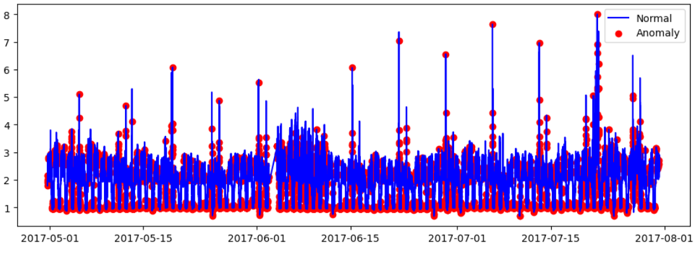
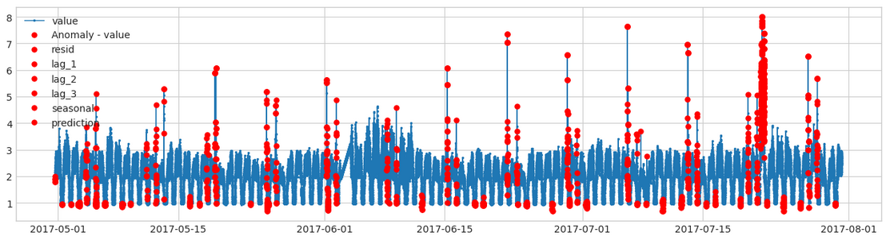
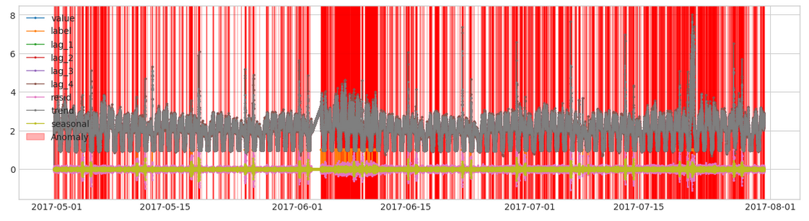
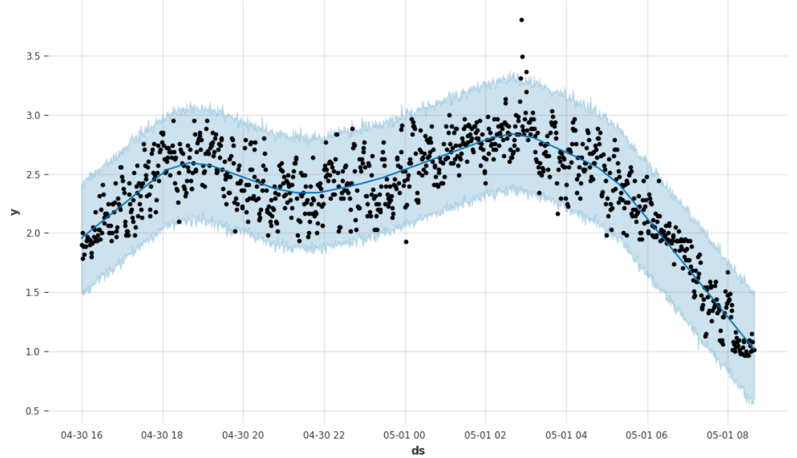
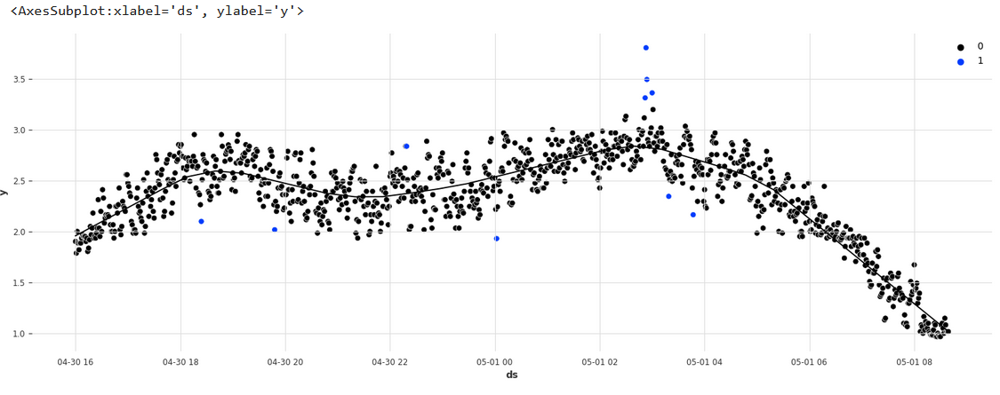
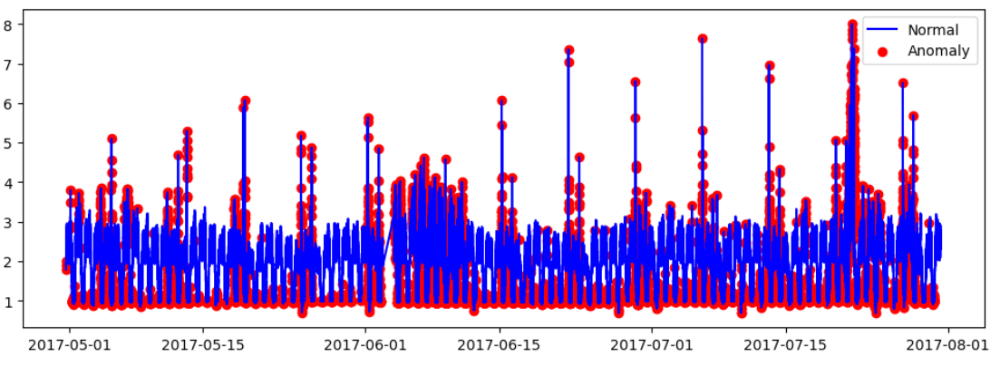

# Time-Series-Anomaly-Detecion
Complete Analysis To Detect Anomalies  On  a 'Time Series 'Problem

##  ⚡️ Clustering Based Detection

## ⚡️ Forecating Based Detection

## ⚡️ Reconstruction Based Detection

# Reports
* IsolationForest(contamination=0.05) -> Final Score: 0.42531 - Features: ['value', 'resid', 'lag_1', 'lag_2']
* IsolationForest(contamination=0.09) -> Final Score: 0.40677 - Features: ['value', 'resid', 'lag_1', 'lag_2']
* IsolationForest(contamination=0.07) -> Final Score: 0.39193 - Features: ['value', 'resid', 'lag_1', 'lag_2', 'lag_3', 'lag_4', 'trend', 'seasonal']
* IsolationForest(contamination=0.07) -> Final Score: 0.43533 - Features: ['value', 'resid', 'lag_1', 'lag_2']
* IsolationForest(contamination=0.07) -> Final Score: 0.43346 - Features: ['value', 'resid', 'lag_1', 'lag_2', 'lag_3', 'lag_4']
* IsolationForest(contamination=0.07) -> Final Score: 0.41407 - Features: ['value', 'resid', 'lag_1', 'lag_2', 'trend']
* IsolationForest(contamination=0.06) -> Final Score: 0.44024 - Features: ['value', 'resid', 'lag_1', 'lag_2', 'lag_3']
* IsolationForest() -> Final Score: 0.29377 - Features: ['value', 'resid', 'lag_1', 'lag_2', 'lag_3']
* IsolationForest(contamination=0.06, n_estimators=500) -> Final Score: 0.42656 - Features: ['value', 'resid', 'lag_1', 'lag_2', 'lag_3']
* IsolationForest(contamination=0.06, n_estimators=50) -> Final Score: 0.45001 - Features: ['value', 'resid', 'lag_1', 'lag_2', 'lag_3']
* IsolationForest(contamination=0.06, n_estimators=50) -> Final Score: 0.45423 - Features: ['value', 'resid', 'lag_1', 'lag_2', 'lag_3', 'seasonal']
* IsolationForest(contamination=0.06, n_estimators=50) -> Final Score: 0.42298 - Features: ['value', 'lag_1', 'lag_2', 'lag_3', 'seasonal']
* IsolationForest(contamination=0.06, n_estimators=50) -> Final Score: 0.44895 - Features: ['resid', 'lag_1', 'lag_2', 'lag_3', 'seasonal']
* IsolationForest(contamination=0.06, n_estimators=50) -> Final Score: 0.45074 - Features: ['scaled', 'resid', 'lag_1', 'lag_2', 'lag_3', 'seasonal'] (All features scaled except resid & seasonal)
* IsolationForest(contamination=0.06, n_estimators=50) -> Final Score: 0.43733 - Features: ['scaled', 'resid', 'lag_1', 'lag_2', 'lag_3', 'seasonal'] (All features scaled)
* IsolationForest(contamination=0.06, n_estimators=50) -> Final Score: 0.47006 - Features: ['value', 'resid', 'lag_1', 'lag_2', 'lag_3', 'lag_4', 'seasonal'] - STL period=4 ### BEST ###
* IsolationForest(contamination=0.06, n_estimators=50) -> Final Score: 0.44298 - Features: ['value', 'resid', 'lag_1', 'lag_2', 'lag_3', 'lag_4', 'lag_5', 'lag_6', 'lag_7', 'lag_8', 'lag_9', 'seasonal'] - STL period=9
* IsolationForest(contamination=0.06, n_estimators=25) -> Final Score: 0.45929 - Features: ['value', 'resid', 'lag_1', 'lag_2', 'lag_3', 'lag_4', 'seasonal'] - STL period=4
* IsolationForest(contamination=0.05, n_estimators=50) -> Final Score: 0.36865 - Features: ['value', 'resid', 'lag_1', 'lag_2', 'lag_3', 'lag_4', 'seasonal'] - STL period=4
* IsolationForest(contamination=0.06, n_estimators=200, max_samples=1500) -> Final Score: 0.40370 - Features: ['value', 'resid', 'lag_1', 'lag_2', 'lag_3', 'lag_4', 'seasonal'] - STL period=4
* IsolationForest(contamination=0.065, n_estimators=100, max_samples=50) -> Final Score: 0.42349 - Features: ['value', 'resid', 'lag_1', 'lag_2', 'lag_3', 'lag_4', 'seasonal'] - STL period=4
* IsolationForest(contamination=0.06, n_estimators=50, max_samples=50) -> Final Score: 0.41291 - Features: ['value', 'resid', 'lag_1', 'lag_2', 'lag_3', 'lag_4', 'seasonal'] - STL period=4
* IsolationForest(contamination=0.06, n_estimators=50) -> Final Score: 0.45638 - Features: ['value', 'resid', 'lag_1', 'lag_2', 'lag_3','lag_4','seasonal', 'lag+1', 'lag+2', 'lag+3'] - STL period=4
* IsolationForest(contamination=0.06, n_estimators=50) -> Final Score: 0.41467 - Features: ['value', 'resid', 'lag_1', 'lag_2', 'lag_3','lag_4', 'seasonal', 'pca'] - STL period=4
* IsolationForest(contamination=0.06, n_estimators=50) -> Final Score: 0.38620 - Features: ['value', 'pca' - 'value'] - STL period=4
* IsolationForest(contamination=0.05, n_estimators=50) -> Final Score: 0.33792 - Features: ['pca1', 'pca2', 'pca3'] - STL period=4
* PcaAd(k=2, c=3.0) -> Final Score: 0.20631 - Features: ['value', 'resid', 'lag_1', 'lag_2', 'lag_3']
* PersistAD(c=3.0, side='both', window=20) -> Final Score: 0.22138 - Features: ['value']
* KNN(contamination=0.06) -> Final Score: 0.26736 - Features: ['value', 'resid', 'lag_1', 'lag_2', 'lag_3']
* COPOD(contamination=0.06) -> Final Score: 0.26780 - Features: ['value', 'resid', 'lag_1', 'lag_2', 'lag_3', 'seasonal']
